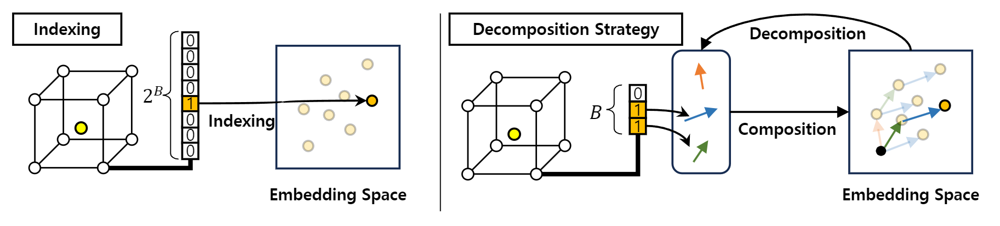
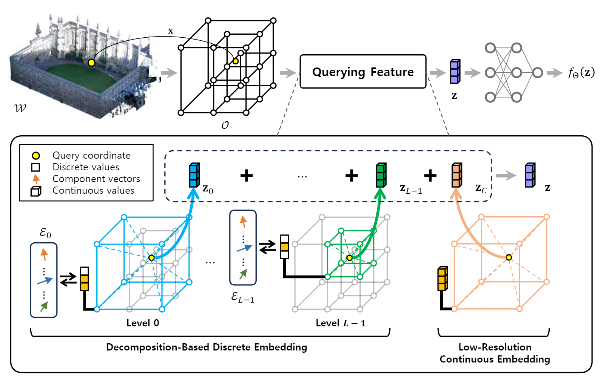

# [ECCV 2024] Decomposition of Neural Discrete Representations for Large-Scale 3D Mapping
> Minseong Park, Suhan Woo, Euntai Kim*<br>
> School of Electrical and Electronic Engineering, Yonsei University, Seoul, Korea<br>
>
<details>
<summary> Abstract </summary>
Learning efficient representations of local features is a key
challenge in feature volume-based 3D neural mapping, especially in largescale environments. In this paper, we introduce Decomposition-based
Neural Mapping (DNMap), a storage-efficient large-scale 3D mapping
method that employs a discrete representation based on a decomposition
strategy. This decomposition strategy aims to efficiently capture repetitive and representative patterns of shapes by decomposing each discrete
embedding into component vectors that are shared across the embedding
space. Our DNMap optimizes a set of component vectors, rather than
entire discrete embeddings, and learns composition rather than indexing the discrete embeddings. Furthermore, to complement the mapping
quality, we additionally learn low-resolution continuous embeddings that
require tiny storage space. By combining these representations with a
shallow neural network and an efficient octree-based feature volume, our
DNMap successfully approximates signed distance functions and compresses the feature volume while preserving mapping quality.
</details>

Maicity(~100 iteration)|Newer College (~1000 iteratin)|
:-: | :-: |
||





## Mapping quality on Newer College dataset (accuracy&downarrow;, completeness&downarrow;, Chamfer-L1 distance&downarrow;, F-score&uparrow;)

||Mapping Quality|<center>Storage</center>|Time|
|-|:-:|-:|-|
|SHINE-Mapping|7.42/**10.47**/<u>8.94</u>/92.96|42187kB (100.0%)|**35m 58s**|
|Ours-discrete (8-bit)|<u>7.24</u>/10.93/9.08/<u>93.35</u>|**1321**kB ( &nbsp;&nbsp;&nbsp;**3.1**%)|<u>37m 27s</u>|
|Ours-full (8-bit)|**6.68**/<u>10.64</u>/**8.67**/**93.60**|<u>2867</u>kB ( &nbsp;&nbsp;&nbsp;<u>6.8</u>%)|45m 27s|

## Installation
To set up environment, run the commands:
```
conda create --name dnmap python=3.7
conda activate dnmap

# To install the requirements
pip install torch==1.12.1+cu116 torchvision==0.13.1+cu116 torchaudio==0.12.1 --extra-index-url https://download.pytorch.org/whl/cu116
pip install kaolin==0.12.0 -f https://nvidia-kaolin.s3.us-east-2.amazonaws.com/torch-1.12.1_cu116.html
pip install open3d scikit-image wandb tqdm natsort pyquaternion
```
## Data preparation
[MaiCity](https://www.ipb.uni-bonn.de/data/mai-city-dataset/)<br>
[Newer College](https://ori-drs.github.io/newer-college-dataset/)<br>

## Mapping
For mapping, run the command:
```
python mapping.py [CONFIG_PATH]
```
Note that if you run the command with `o3d_vis_on=True` option in the config file, the final neural map will only be saved after the visualization window closes properly (press 'q').
<details>
<summary> Example </summary>


```
python mapping.py config/maicity/dnmap_full_batch.yaml 
```

</details>

## Map visualization
For visualization, run the command:
```
python visualization.py [EXPERIMENT_PATH]
```

## Citation

```
@InProceedings{park2024dnmap,
    author    =  {Park, Minseong and Woo, Suhan and Kim, Euntai},
    title     = {Decomposition of Neural Discrete Representations for Large-Scale 3D Mapping},
    booktitle = {European Conference on Computer Vision (ECCV)},
    year      = {2024}
}
```

## Acknowledgment
Our code is based on implementation of previous work, [SHINE-Mapping](https://github.com/PRBonn/SHINE_mapping).